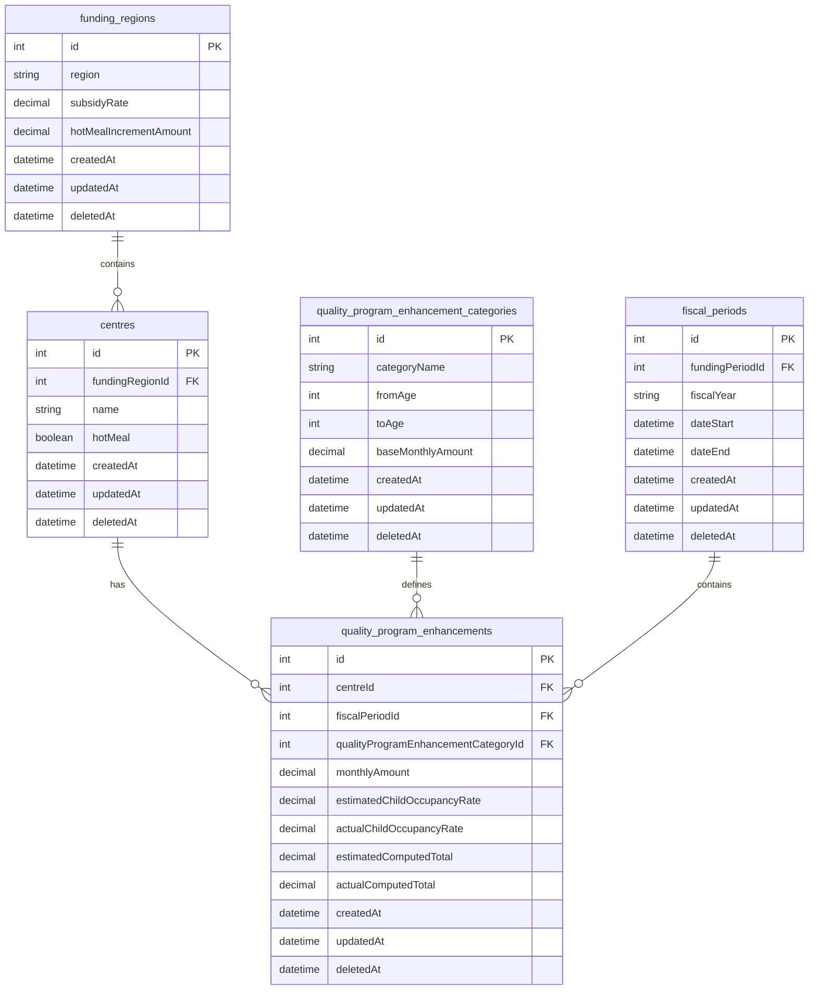

# Plan: Hot Meal Feature Implementation Approaches

## Problem Statement

This plan addresses two related issues:
- **ELCC-82**: Model Quality Program Enhancement section per centre and month
- **ELCC-63**: Child Care Center Details "Hot Meal" Option Does Not Effect Worksheet "Quality Program Enhancement" Section

The implementation is structured in two parts:
- **Part 1**: ELCC-82 - Create dedicated Quality Program Enhancement model structure
- **Part 2**: ELCC-63 - Implement hot meal feature using the new model

Part 1 establishes the foundation (dedicated models and admin interface) that enables Part 2 to implement the hot meal feature cleanly and maintainably.

## Current State Analysis

**Current Implementation:**

- Worksheet data stored in `funding_submission_line_jsons` table as JSON
- Quality Program Enhancement values are fixed in `FUNDING_SUBMISSION_LINE_DEFAULTS`
- Hot meal setting exists as `centre.hotMeal: boolean | null`
- Frontend displays worksheet data via `FundingSubmissionLineJsonSectionTable.vue`
- Data flows through serializer layer without business logic

**ELCC-82 Pattern:**

- Targeted model creation for specific worksheet sections
- Per-centre, per-month data structure
- Clean separation of concerns for individual sections

## Key Findings

1. **Dedicated Model Approach**: Moving away from JSON structure to dedicated models for Quality Program Enhancement
2. **Data Structure**: Quality Program Enhancement will have dedicated tables with proper relationships
3. **Update Complexity**: Model approach requires direct field updates with proper service layer
4. **Temporal Logic**: Need to handle "current and future months" vs "future only" updates correctly in the new model
5. **Quality Program Enhancement is Isolated**: Only one section needs the hot meal logic, other sections remain in JSON
6. **Admin Configurability**: Categories and base rates will be configurable through admin interface instead of hardcoded defaults

## ELCC-82 Approach - Detailed Update Pipeline

### Scenario 1: Funding Region Update (Affects ALL centres in region)

**Required Service Changes:**

- Extend `FundingRegionUpdateService` to detect `hotMealIncrementAmount` changes
- Add `UpdateQualityProgramEnhancementForRegionService` that:
  - Finds all centres in the funding region
  - Finds all `QualityProgramEnhancement` records for those centres (current + future months)
  - Updates `monthlyAmount` field directly: `baseAmount + hotMealIncrementAmount`
  - Saves updated records

**Complexity: MEDIUM** - Direct field updates, no JSON parsing

### Scenario 2: Centre Hot Meal Toggle (Affects single centre)

**Required Service Changes:**

- Extend `CentreUpdateService` to detect `hotMeal` field changes
- Add `UpdateQualityProgramEnhancementForCentreService` that:
  - Finds all `QualityProgramEnhancement` records for that centre (current + future months)
  - Updates `monthlyAmount` field directly: `baseAmount + (centre.hotMeal ? hotMealIncrementAmount : 0)`
  - Saves updated records

**Complexity: LOW** - Simple field updates, predictable logic

### ELCC-82 Advantages:

1. **Direct Field Updates**: No JSON parsing/serialization
2. **Type Safety**: Proper database fields with constraints
3. **Performance**: Faster updates, no JSON manipulation
4. **Data Integrity**: Lower risk of data corruption
5. **Rollback Support**: Easy to undo changes with database transactions
6. **Testing Simplicity**: Fewer edge cases, more predictable behavior
7. **Audit Trail**: Clear database changes for compliance
8. **Admin Configurability**: Categories and base rates manageable through admin interface

### ELCC-82 Dedicated Quality Program Enhancement Model
**Rationale:** Creates dedicated model for Quality Program Enhancement with configurable categories and rates, following existing patterns while avoiding hardcoded enums

## Data Model Architecture

## Implementation

### Part 1: ELCC-82 - Create Dedicated Quality Program Enhancement Model Structure

**Objective**: Establish the foundation by creating dedicated models and admin interface for Quality Program Enhancement data.

**Steps:**
1. Create `QualityProgramEnhancementCategory` model: `id`, `categoryName`, `fromAge`, `toAge`, `baseMonthlyAmount` (configurable categories and base rates, replacing hardcoded defaults)
2. Create `QualityProgramEnhancement` model: `id`, `centreId`, `fiscalPeriodId`, `qualityProgramEnhancementCategoryId`, `monthlyAmount`, `estimatedChildOccupancyRate`, `actualChildOccupancyRate`, `estimatedComputedTotal`, `actualComputedTotal` (time-dependent data)
3. Create migration to populate QualityProgramEnhancementCategory table from existing Quality Program Enhancement defaults in `FUNDING_SUBMISSION_LINE_DEFAULTS`
4. Create admin interface for managing Quality Program Enhancement categories and base rates
5. Update worksheet serialization to read Quality Program Enhancement from new model (fallback to JSON for backward compatibility)

**Outcome**: Dedicated model structure with admin-configurable categories and rates, ready for hot meal implementation.

### Part 2: ELCC-63 - Implement Hot Meal Feature Using New Model

**Objective**: Implement the hot meal feature using the foundation established in Part 1.

**Steps:**
1. Add hot meal increment field to existing `FundingRegion` table: `hotMealIncrementAmount` (time-independent data) - represents the flat $32.06 increase applied to all age groups when hot meal is enabled
2. Create migration to add hot meal increment field and populate with $32.06 for all existing regions
3. Update QualityProgramEnhancement service to calculate monthlyAmount: `QualityProgramEnhancementCategory.baseMonthlyAmount + (centre.hotMeal ? fundingRegion.hotMealIncrementAmount : 0)`
4. Create services for handling hot meal updates:
   - `UpdateQualityProgramEnhancementForRegionService` (when funding region hot meal rate changes)
   - `UpdateQualityProgramEnhancementForCentreService` (when centre hot meal toggle changes)
5. Update frontend to handle mixed data sources (JSON for other sections, new model for Quality Program Enhancement)

**Outcome**: Hot meal feature fully implemented with proper data model and update services.
  **Benefits:**
- Clean data model with proper relationships
- Eliminates hardcoded enums through configurable categories
- Admin interface for managing Quality Program Enhancement categories and base rates
- Follows existing patterns (like building_expense_categories)
- Easy to extend with additional categories or rate changes
- Better performance for Quality Program Enhancement queries
- Foundation for future Quality Program Enhancement features
- Follows single responsibility principle
- Maintains data integrity through proper foreign key relationships

## Decision Factors

1. **Time to Delivery**: JSON approach is faster (1-2 days vs 1-2 weeks)
2. **Code Complexity**: JSON approach is simpler (minimal changes vs new model + migration)
3. **Future Extensibility**: Model approach is better for future Quality Program Enhancement enhancements
4. **Risk**: JSON approach is lower risk (no database changes vs migration + new code)
5. **Architecture**: Model approach aligns better with long-term architectural goals

## Recommended Action

**Go with Option 2 (ELCC-82 Dedicated Model) despite longer initial implementation.**

**Reasoning:**
The JSON approach complexity is significantly underestimated:

- **Funding Region Updates**: JSON approach requires complex cross-centre JSON manipulation
- **Centre Hot Meal Toggles**: JSON parsing/serialization for every update
- **Data Integrity Risk**: High risk of JSON corruption during bulk updates
- **Testing Complexity**: Complex JSON transformation logic to test
- **Performance**: Slower JSON updates vs direct field updates
- **Maintenance Burden**: Ongoing complexity for every future change

**ELCC-82 Advantages:**

- **Clean Update Logic**: Simple field updates, no JSON manipulation
- **Scalable**: Easy to extend for future enhancements
- **Reliable**: Lower risk, better error handling
- **Maintainable**: Follows established patterns, easier to understand
- **Future-Proof**: Proper foundation for additional Quality Program Enhancement features

**Implementation Strategy:**

1. Implement ELCC-82 with proper migration from existing JSON data
2. Add hot meal increment field to FundingRegion table
3. Create services for both funding region and centre update scenarios
4. Thoroughly test the update pipelines
5. Deploy with confidence in the robust architecture

The upfront investment in ELCC-82 pays off significantly in reduced complexity, better reliability, and easier maintenance.

## Files to Review

1. `api/src/serializers/funding-submission-line-json-serializer.ts` - Primary location for JSON approach implementation
2. `api/src/models/funding-submission-line-defaults.ts` - Current Quality Program Enhancement values
3. `api/src/models/centre.ts` - Hot meal field definition
4. `web/src/components/funding-submission-line-jsons/FundingSubmissionLineJsonSectionTable.vue` - Frontend display logic

---

## Files Changed

### Part 1: ELCC-82 - Create Dedicated Quality Program Enhancement Model Structure

| File                                                                                    | Change                                                    |
| --------------------------------------------------------------------------------------- | --------------------------------------------------------- |
| `api/src/models/quality-program-enhancement-category.ts`                                | New model for configurable categories and base rates      |
| `api/src/models/quality-program-enhancement.ts`                                         | New model file (time-dependent data)                      |
| `api/src/db/migrations/YYYY.MM.DD.create-quality-program-enhancement-tables.ts`          | Create QPE category and enhancement tables                |
| `web/src/pages/administration/quality-program-enhancement-categories/`                    | New admin interface for managing categories and rates     |
| `api/src/controllers/quality-program-enhancement-categories-controller.ts`               | New controller for QPE category CRUD operations           |
| `api/src/serializers/funding-submission-line-json-serializer.ts`                        | Update to read Quality Program Enhancement from new model |

### Part 2: ELCC-63 - Implement Hot Meal Feature Using New Model

| File                                                                                    | Change                                                    |
| --------------------------------------------------------------------------------------- | --------------------------------------------------------- |
| `api/src/models/funding-region.ts`                                                      | Add hotMealIncrementAmount field to existing model        |
| `api/src/db/migrations/YYYY.MM.DD.add-hot-meal-increment-to-funding-regions.ts`         | Add hot meal increment field                              |
| `api/src/services/centres/update-quality-program-enhancement-for-centre-service.ts`     | New service for centre hot meal toggle updates            |
| `api/src/services/funding-regions/update-quality-program-enhancement-for-region-service.ts` | New service for funding region hot meal rate updates     |
| `api/src/controllers/funding-submission-line-jsons-controller.ts`                       | Update to include centre data for hot meal logic          |
| `web/src/components/funding-submission-line-jsons/FundingSubmissionLineJsonSectionTable.vue` | Update to handle mixed data sources (JSON + new model)   |

### Final Step: Cleanup and Documentation

**Objective**: Remove the implementation plan and commit all changes.

**Steps:**
1. Remove this plan file: `agents/plans/Plan, Hot Meal Feature Implementation Approaches, 2026-04-15.md`
2. Stage all implementation changes
3. Commit with comprehensive commit message following COMMITTING.md guidelines

---

## Related Issues

- ELCC-63: Child Care Center Details "Hot Meal" Option Does Not Effect Worksheet "Quality Program Enhancement" Section
- ELCC-82: Model Quality Program Enhancement section per centre and month
- ELCC-79: Epic: split worksheet sections into per-centre, per-month models (broader scope)
