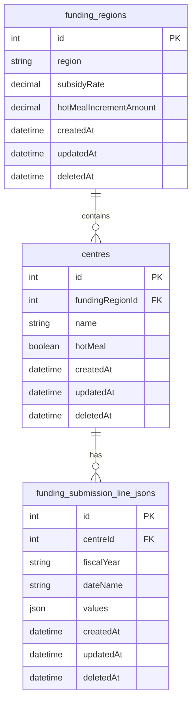

# Plan: Hot Meal Feature Implementation

## Problem Statement

This plan addresses the hot meal feature requirement:
- **ELCC-63**: Child Care Center Details "Hot Meal" Option Does Not Effect Worksheet "Quality Program Enhancement" Section

## Approach: Add Hot Meal Increment to Funding Region

Add `hotMealIncrementAmount` field directly to funding regions table and apply it during JSON serialization. This maintains existing UI patterns while enabling hot meal functionality.

## Current State Analysis

**Current Implementation:**

- Worksheet data stored in `funding_submission_line_jsons` table as JSON
- Quality Program Enhancement values are fixed in `FUNDING_SUBMISSION_LINE_DEFAULTS`
- Hot meal setting exists as `centre.hotMeal: boolean | null`
- Frontend displays worksheet data via `FundingSubmissionLineJsonSectionTable.vue`
- Data flows through serializer layer without business logic

**Note**: Relabel "Quality Program Enhancement" to "Quality Enhancement Program" throughout the system (database, UI, documentation) for consistency.

**Critical UI Dependency Discovered:**

- Section 1 (Child Care Spaces) → Section 2 (Administration) → Section 3 (Quality Program Enhancement)
- When users update child counts in Section 1, they automatically propagate to Sections 2 and 3
- This propagation would break if we migrated only Section 3 to a dedicated model
- The enhancement types approach maintains this existing UI behavior

## Key Findings

1. **UI Propagation Dependency**: Section 1 child count updates automatically sync to Section 3
2. **JSON Serialization Approach**: Hot meal increment can be applied during JSON generation
3. **Funding Region Linkage**: Different regions can have different hot meal increment amounts
4. **Minimal Disruption**: Existing reconciliation and UI patterns remain unchanged

## Data Model Architecture



## Implementation

### Part 1: Add Hot Meal Increment to Funding Region

**Objective**: Add hot meal increment amount directly to funding regions table for simplicity.

**Steps:**
1. Create migration to add `hotMealIncrementAmount` field to `funding_regions` table:
   - Field type: DECIMAL(10, 4)
   - Default value: 32.06 for existing regions
   - Allow null for future flexibility

2. Update FundingRegion model to include the new field

**Outcome**: Hot meal increment amount stored per funding region, ready for JSON serialization.

### Part 2: Update JSON Serialization for Hot Meal Support

**Objective**: Modify worksheet JSON serialization to apply hot meal increment based on centre settings.

**Steps:**
1. Locate the serialization service that generates `funding_submission_line_jsons.values`
2. Add hot meal logic:
   - Get centre's funding region and hot meal setting
   - Retrieve hot meal increment amount from `fundingRegion.hotMealIncrementAmount`
   - Apply increment to Quality Program Enhancement amounts when `centre.hotMeal` is true

3. Update calculation logic:
   ```javascript
   const baseAmount = getBaseAmountFromDefaults(categoryName)
   const hotMealIncrement = centre.hotMeal ? fundingRegion.hotMealIncrementAmount : 0
   const finalAmount = baseAmount + hotMealIncrement
   ```

4. Ensure computed totals are recalculated with enhanced amounts

**Outcome**: Hot meal functionality applied during JSON generation, maintaining all existing UI patterns.

### Part 3: Frontend Hot Meal Toggle Integration

**Objective**: Update frontend to refresh worksheet data when hot meal setting changes.

**Steps:**
1. Locate the centre edit form or hot meal toggle component
2. Add refresh logic when `centre.hotMeal` changes:
   - Call existing worksheet data refresh method
   - Show loading state during refresh
   - Display success/error notifications

3. Ensure proper error handling for serialization failures

**Outcome**: Users can toggle hot meal setting and see updated amounts immediately in the worksheet.

### Part 4: Testing and Validation

**Objective**: Ensure hot meal functionality works correctly across all scenarios.

**Steps:**
1. Test hot meal toggle on/off for different centres
2. Verify amounts are correct for all age categories
3. Confirm funding reconciliation includes enhanced amounts
4. Test UI propagation still works (Section 1 → Section 3)
5. Validate different funding regions can have different increment amounts

**Outcome**: Hot meal feature fully functional and tested.

## Funding Region Update Considerations

When `fundingRegion.hotMealIncrementAmount` is changed:
- Must update all centres in the affected region
- Must update current and future months (not past months)
- Must regenerate `funding_submission_line_jsons` for affected periods
- Requires bulk update service with proper transaction handling

## Future Considerations

If multiple enhancement types are needed in the future:
- Create dedicated `program_enhancement_types` table
- Migrate hot meal logic to use the enhancement types table
- Support additional enhancement types as needed

## Files to Review

1. `api/src/serializers/funding-submission-line-json-serializer.ts` - JSON serialization implementation
2. `api/src/models/funding-submission-line-defaults.ts` - Current Quality Program Enhancement values
3. `api/src/models/funding-region.ts` - Add hotMealIncrementAmount field
4. `web/src/components/funding-submission-line-jsons/FundingSubmissionLineJsonSectionTable.vue` - Frontend display logic

## Implementation Status

### ✅ Completed

| File                                                                                    | Change                                                    |
| --------------------------------------------------------------------------------------- | --------------------------------------------------------- |
| `api/src/models/funding-region.ts`                                                      | ✅ Added hotMealIncrementAmount field with defaults       |
| `api/src/db/migrations/2026.04.15T16.00.00.add-hot-meal-increment-to-funding-regions.ts` | ✅ Schema migration for hot meal increment field          |
| `api/src/db/migrations/2026.04.15T16.01.00.backfill-hot-meal-increment-for-funding-regions.ts` | ✅ Backfill existing regions with $32.06 default          |

### 🔄 In Progress

| File                                                                                    | Change                                                    |
| --------------------------------------------------------------------------------------- | --------------------------------------------------------- |
| `api/src/serializers/funding-submission-line-json-serializer.ts`                        | 🔄 Update JSON serialization for hot meal logic              |
| `api/src/services/funding-regions/update-hot-meal-for-region-service.ts`                | 🔄 Service for funding region hot meal updates              |
| `web/src/components/centres/CentreEditForm.vue`                                        | 🔄 Add refresh logic when hot meal toggle changes            |

## Related Issues

- ELCC-63: Child Care Center Details "Hot Meal" Option Does Not Effect Worksheet "Quality Program Enhancement" Section
