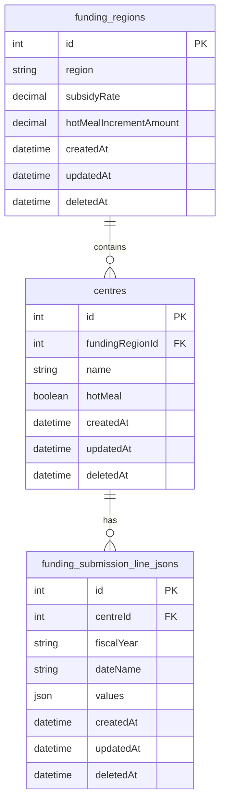

# Plan: Hot Meal Feature Implementation

## Problem Statement

This plan addresses the hot meal feature requirement:
- **ELCC-63**: Child Care Center Details "Hot Meal" Option Does Not Effect Worksheet "Quality Program Enhancement" Section

## Approach: Add Hot Meal Increment to Funding Region

Add `hotMealIncrementAmount` field directly to funding regions table and apply it during JSON serialization. This maintains existing UI patterns while enabling hot meal functionality.

## Current State Analysis

**Current Implementation:**

- Worksheet data stored in `funding_submission_line_jsons` table as JSON
- Quality Program Enhancement values are fixed in `FUNDING_SUBMISSION_LINE_DEFAULTS`
- Hot meal setting exists as `centre.hotMeal: boolean`
- Frontend displays worksheet data via `FundingSubmissionLineJsonSectionTable.vue`
- Data flows through serializer layer without business logic

**Note**: Relabel "Quality Program Enhancement" to "Quality Enhancement Program" throughout the system (database, UI, documentation) for consistency.

**Critical UI Dependency Discovered:**

- Section 1 (Child Care Spaces) → Section 2 (Administration) → Section 3 (Quality Program Enhancement)
- When users update child counts in Section 1, they automatically propagate to Sections 2 and 3
- This propagation would break if we migrated only Section 3 to a dedicated model
- The enhancement types approach maintains this existing UI behavior

## Key Findings

1. **UI Propagation Dependency**: Section 1 child count updates automatically sync to Section 3
2. **JSON Serialization Approach**: Hot meal increment can be applied during JSON generation
3. **Funding Region Linkage**: Different regions can have different hot meal increment amounts
4. **Minimal Disruption**: Existing reconciliation and UI patterns remain unchanged

## Data Model Architecture

## Hot Meal Logic Implementation Locations

The hot meal increment logic needs to be applied in the following locations where `funding_submission_line_jsons` are created or updated:

### 1. Centre Creation
- **File**: `api/src/services/centres/create-service.ts`
- **Trigger**: When a new centre is created
- **Flow**: `CreateService` → `EnsureChildrenService` → `BulkEnsureService` → `BulkCreateService`
- **Status**: ✅ Already covered via `BulkCreateService`

### 2. Centre Update (Hot Meal Toggle)
- **File**: `api/src/services/centres/update-service.ts`
- **Trigger**: When centre.hotMeal is toggled on/off
- **Current Behavior**: Only updates centre record, does not trigger JSON regeneration
- **Required**: Add logic to regenerate `funding_submission_line_jsons` for current and future periods when hotMeal changes
- **Status**: ❌ NOT IMPLEMENTED

### 3. Funding Region Creation
- **File**: `api/src/services/funding-regions/create-service.ts`
- **Trigger**: When a new funding region is created
- **Flow**: Creates funding region with default hotMealIncrementAmount
- **Status**: ✅ Already covered via default values

### 4. Funding Region Update (Hot Meal Increment Amount Change)
- **File**: `api/src/services/funding-regions/update-service.ts`
- **Trigger**: When fundingRegion.hotMealIncrementAmount is changed
- **Current Behavior**: Only updates funding region record, does not trigger JSON regeneration
- **Required**: Add logic to regenerate `funding_submission_line_jsons` for all centres in affected region for current and future periods
- **Service Available**: `BulkApplyHotMealEnhancementForRegionService` - ready to use
- **Status**: ❌ NOT INTEGRATED

### 5. Bulk Create Service (JSON Generation)
- **File**: `api/src/services/centres/funding-periods/funding-submission-line-jsons/bulk-create-service.ts`
- **Trigger**: Called by `BulkEnsureService` when JSONs need to be created
- **Current Behavior**: ✅ Already includes hot meal logic
- **Status**: ✅ IMPLEMENTED

### 6. Bulk Ensure Service
- **File**: `api/src/services/centres/funding-periods/funding-submission-line-jsons/bulk-ensure-service.ts`
- **Trigger**: Called by `EnsureChildrenService` to ensure JSONs exist
- **Flow**: Calls `BulkCreateService` if JSONs don't exist
- **Status**: ✅ Already covered via `BulkCreateService`

### 7. Ensure Children Service
- **File**: `api/src/services/centres/funding-periods/ensure-children-service.ts`
- **Trigger**: Called during centre creation and when ensuring child entities
- **Flow**: Calls `BulkEnsureService` for funding submission line jsons
- **Status**: ✅ Already covered via `BulkEnsureService`

### 8. Replicate Estimates Service
- **File**: `api/src/services/funding-submission-line-jsons/replicate-estimates-service.ts`
- **Trigger**: When replicating estimates from current period to future periods
- **Current Behavior**: Replicates estimates but does NOT include hot meal logic
- **Required**: Add hot meal logic to ensure replicated estimates include proper hot meal increments
- **Status**: ❌ NOT IMPLEMENTED

### 9. Bulk Apply Hot Meal Enhancement for Region Service
- **File**: `api/src/services/funding-regions/program-enhancement-expenses/bulk-apply-hot-meal-enhancement-for-region-service.ts`
- **Purpose**: Bulk update all centres in a region for current and future periods
- **Status**: ✅ IMPLEMENTED (ready for integration)

### 10. Frontend Refresh on Hot Meal Toggle
- **File**: `web/src/components/centres/CentreEditForm.vue` (or similar)
- **Trigger**: When user toggles hot meal in the UI
- **Required**: Call backend to regenerate JSONs and refresh worksheet data
- **Status**: ❌ NOT IMPLEMENTED

## Implementation Priority

### High Priority (Core Functionality)
1. **Centre Update (Hot Meal Toggle)** - Users need immediate feedback when toggling hot meal
2. **Funding Region Update (Hot Meal Increment Amount)** - Admins need to apply new rates to existing centres
3. **Replicate Estimates Service** - Ensure future periods have correct hot meal increments

### Medium Priority (Edge Cases)
4. **Frontend Refresh Integration** - Improve UX by showing immediate feedback
5. **Error Handling** - Proper error handling for bulk operations

## Implementation Steps

### Step 1: Update Centre Update Service
- Modify `api/src/services/centres/update-service.ts`
- Detect when `hotMeal` attribute is being changed
- If hotMeal changed, trigger JSON regeneration for current and future periods
- Use existing `BulkApplyHotMealEnhancementForRegionService` pattern

### Step 2: Update Funding Region Update Service
- Modify `api/src/services/funding-regions/update-service.ts`
- Detect when `hotMealIncrementAmount` attribute is being changed
- If changed, trigger bulk update for all centres in region
- Call `BulkApplyHotMealEnhancementForRegionService`

### Step 3: Update Replicate Estimates Service
- Modify `api/src/services/funding-submission-line-jsons/replicate-estimates-service.ts`
- Add hot meal logic to replicated estimates
- Ensure future periods have correct hot meal increments based on centre settings

### Step 4: Frontend Integration
- Add refresh logic when hot meal toggle changes
- Show loading state during JSON regeneration
- Display success/error notifications

### Step 5: Testing
- Test centre creation with hot meal enabled/disabled
- Test centre update when toggling hot meal
- Test funding region update when changing increment amount
- Test replicate estimates with hot meal logic
- Verify funding reconciliation includes enhanced amounts

## Implementation Status

### ✅ Completed

| File                                                                                    | Change                                                    |
| --------------------------------------------------------------------------------------- | --------------------------------------------------------- |
| `api/src/models/funding-region.ts`                                                      | ✅ Added hotMealIncrementAmount field with defaults       |
| `api/src/db/migrations/2026.04.15T16.00.00.add-hot-meal-increment-to-funding-regions.ts` | ✅ Schema migration for hot meal increment field          |
| `api/src/db/migrations/2026.04.15T16.01.00.backfill-hot-meal-increment-for-funding-regions.ts` | ✅ Backfill existing regions with $32.06 default          |
| `api/src/models/centre.ts`                                                              | ✅ Updated hotMeal to non-nullable boolean with default    |
| `api/src/db/migrations/2026.04.16T16.00.00.make-hot-meal-not-nullable.ts`              | ✅ Migration to make hot_meal column not nullable         |
| `api/src/services/centres/funding-periods/funding-submission-line-jsons/bulk-create-service.ts` | ✅ Added hot meal logic to JSON generation                 |
| `api/src/services/funding-regions/program-enhancement-expenses/bulk-apply-hot-meal-enhancement-for-region-service.ts` | ✅ Created bulk apply hot meal enhancement service         |
| `_Design/Entity Relationship Diagrams.wsd`                                             | ✅ Updated ERD with field names and defaults                |

### ❌ Not Implemented

| File                                                                                    | Required Change                                           |
| --------------------------------------------------------------------------------------- | --------------------------------------------------------- |
| `api/src/services/centres/update-service.ts`                                         | Add JSON regeneration when hotMeal toggles                 |
| `api/src/services/funding-regions/update-service.ts`                                  | Add bulk update when hotMealIncrementAmount changes        |
| `api/src/services/funding-submission-line-jsons/replicate-estimates-service.ts`        | Add hot meal logic to replicated estimates                 |
| Frontend hot meal toggle component                                                     | Add refresh logic and loading state                         |

## Related Issues

- ELCC-63: Child Care Center Details "Hot Meal" Option Does Not Effect Worksheet "Quality Program Enhancement" Section
